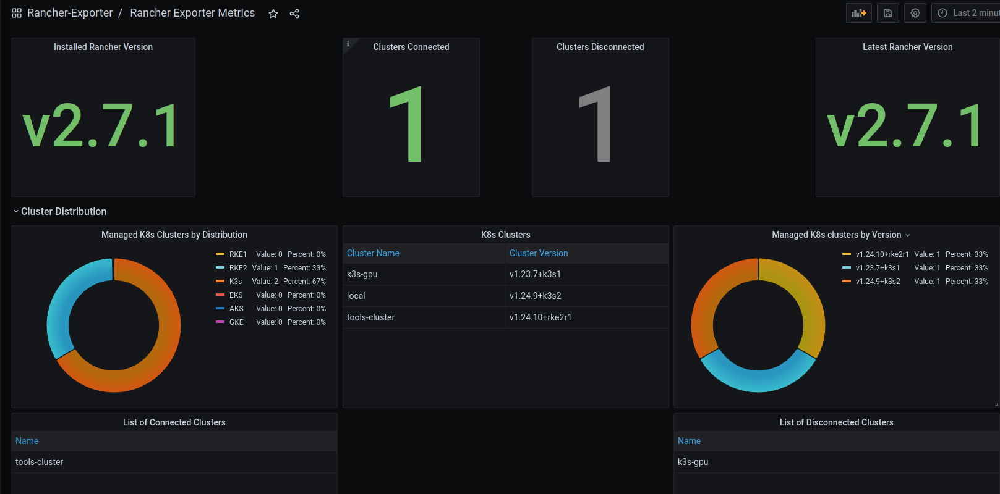
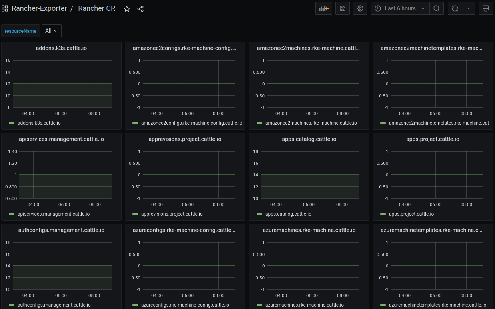

# Unofficial Prometheus Exporter for Rancher

**Note** : This project is not officially supported by Rancher/Suse.

# Quickstart

1. Enable monitoring in the Rancher Management Cluster, aka `local` cluster
2. Apply the manifest from this repo : `kubectl apply -f ./manifests/exporter.yaml`

# Grafana Dashboard

`./manifests/grafana-dashboard` includes a basic dashboard in JSON format that can be imported into Grafana.  
`./manifests/grafana-dashboard-projects.json` includes a Rancher project-focused dashboard in JSON format that can be imported into Grafana.  
`./manifests/grafana-dashboard-all-cr.json` includes a dynamic dashboard showing counts for all Rancher custom resources (*.cattle.io).  






# Developing

By default, the exporter will use in-cluster authentication via a associated service account

## External cluster config

To test using external authentication via the local `kubeconfig`, uncomment the following:

```go
// Use this for out of cluster config
currentUser, err := user.Current()
if err != nil {
	log.Fatal(err.Error())
}

kubeconfig := flag.String("kubeconfig", fmt.Sprintf("/home/%s/.kube/config", currentUser.Username), "absolute path to the kubeconfig file")
flag.Parse()
config, err := clientcmd.BuildConfigFromFlags("", *kubeconfig)
```

Comment out the following
```go
// Use this for in-cluster config 
//config, err := rest.InClusterConfig()
```

* `go run main.go`
* Navigate to http://localhost:8080/metrics
